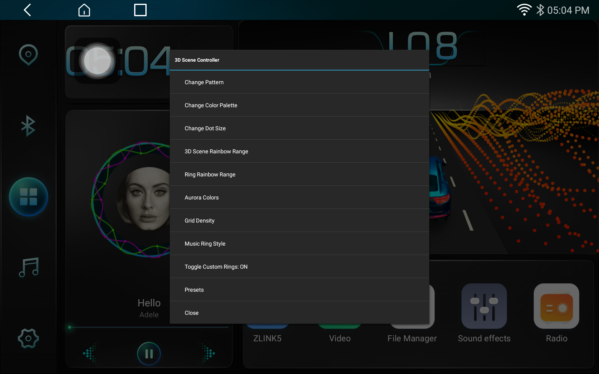

# HeadUnit Hook
### A Deep-Dive into Android Reverse Engineering & OpenGL ES

[](https://android.com)
[](https://github.com/LSPosed/LSPosed)
[](https://kotlinlang.org)
[](https://www.khronos.org/opengles/)
[](https://android.com)


## The Project Story
I bought a budget Android head unit for my car, but the stock interface was locked-down, laggy, and visually dated. As a student interested in how systems work under the hood, I decided to treat the head unit as a "black box" and see if I could inject my own code into the system launcher to modernize it.

The Goal: Replace the stock 2D road animation and music widget with a high-performance 3D engine and dynamic internet-sourced album art—all without having access to the original source code.


## Screenshots

| Nebula wave pattern | Fiber Optic wave pattern |
|---|---|
|  |  |

### Customization UI


## What This Project Does

This LSPosed module hooks into a closed-source Android car launcher (`com.spd.home`) running on an SDM450/MSM8953 head unit (1920×1200, 4GB RAM) and replaces two major UI components entirely at runtime — **without modifying the APK**.

### 3D Road Scene
Replaces the launcher's original Canvas-based road grid with a custom **OpenGL ES 2.0** renderer:
- **18 wave patterns** — from smooth liquid metal to fiber optic cables, DNA helixes, plasma fields, and radar sweeps
- **8 color palettes** — Cyberpunk, Blood Moon, Deep Sea, Gold Rush, Rainbow, Aurora and more
- **Speed-reactive animation** — wave intensity and scroll speed respond to real GPS/CAN bus vehicle speed
- **Asymmetric left/right waves** — each side gets independent phase offsets for an organic, non-mirrored look
- **Real-time grid density control** — adjustable dot count up to 800×800
- **Background image support** — custom PNG background loaded from hook APK resources

### Music Widget
Hooks into `MusicFrameManager` and `MyID3View` to transform the music panel:
- **Bluetooth album art** — fetches from iTunes API (600×600) with Last.fm fallback, memory + disk cached
- **10 ring animation styles** — Pulsing Glow, DNA Double Helix (3D depth rendering), Sound Wave Bars, Minimal Activity Rings, Plasma Energy, Neon Scanner, Colorful Original, Triple DNA, DNA Nodes, Radar Sweep
- **Color-synced rings** — ring colors automatically match the 3D scene palette selection

---

## Project Structure

```
app/src/main/
├── java/com/saeed/headunithook/
│   ├── MainHook.kt          — LSPosed entry point, all hooks, UI panels, album art fetch
│   ├── HighPerfRoadView.kt  — GLSurfaceView wrapper
│   ├── RoadRenderer.kt      — OpenGL ES 2.0 renderer (grid, lines, background)
│   └── Shaders.kt           — GLSL vertex/fragment shaders for all wave patterns
└── res/
    └── drawable/
        └── bg.png           — Background image shown behind the 3D scene
```

---


## Reverse Engineering Notes

The launcher APK (`com.spd.home`) was decompiled using **jadx** to map field names, method signatures, and callback chains. Key classes studied:

- `com.spd.Scene.CarinfoFrameManager` — root view injection point
- `com.spd.roadcar.RoadGrid` — original Canvas road grid (wave math, recycled rows)
- `com.spd.custom.view.MyID3View` — album art view with mask compositing
- `com.spd.custom.view.BtHelper` — Bluetooth AIDL client
- `com.spd.bluetooth.service.BluetoothService` — BT service implementation
---

## License

MIT License. This project is for educational purposes only. I do not own the rights to the com.spd.home application. Use at your own risk when operating a vehicle.

---
